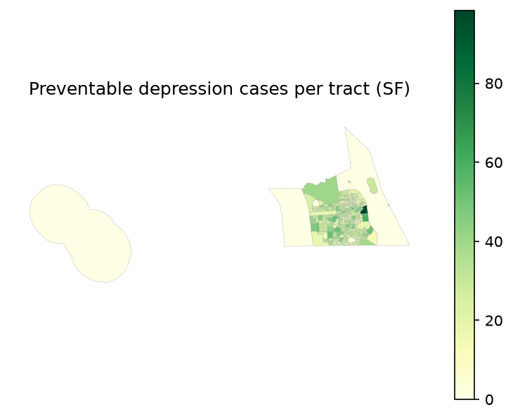

# Model results summary (SF)

_Generated 2026-07-11 from `preventable_cases_cost_sum_sf_2024.csv`._

## Headline

- Preventable depression cases/year: **7,294**
- Avoided societal cost/year: **$155,219,528**
- Tracts analyzed: **244**
- Per-tract cases: mean 29.9, median 29.0, min 0.0, max 98.5

## QA checks

- Implied cost/case $21,280 vs health_cost_rate $21,280 — OK (matches).
- Reminder: baseline cases should use ADULT population (prevalence is adult); if population wasn't adult-scaled, totals are overstated ~20%.
- Greening scenario and effect size are assumptions — read with the sensitivity range below, not as point truth.

## Sensitivity (effect_size × cost)

| effect_size | preventable_cases | cost_low | cost_central | cost_high |
|---|---:|---:|---:|---:|
| 0.887 | 13,851 | $0 | $0 | $0 |
| 0.93 | 8,482 | $0 | $0 | $0 |
| 0.977 | 2,753 | $0 | $0 | $0 |

