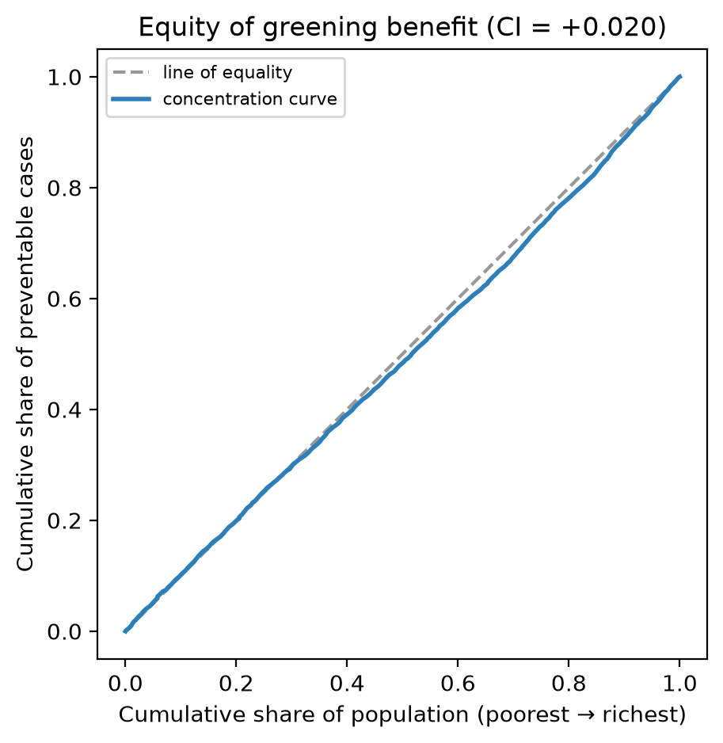

# Equity analysis — who benefits from greening

_237 neighborhoods matched to ACS 2023 income._

## Concentration index

- **CI = +0.020** for the preventable depression *rate* vs. neighborhood median income.
- The benefit concentrates in **evenly across the income gradient**.
- CI ranges −1…+1; 0 = perfectly even. Negative = the greening benefit is larger where incomes are lower (an equity win).

Concentration curve (CI = +0.020). Above the diagonal = benefit concentrated among lower-income residents.

## By income decile (1 = poorest)

| decile | mean tract income | preventable cases / 1,000 adults | % of total cases |
|---:|---:|---:|---:|
| 1 | $38,433 | 7.7 | 7.4% |
| 2 | $85,502 | 5.9 | 9.3% |
| 3 | $106,134 | 16.5 | 9.8% |
| 4 | $120,470 | 5.8 | 10.3% |
| 5 | $139,726 | 5.5 | 10.4% |
| 6 | $153,816 | 5.9 | 11.1% |
| 7 | $169,228 | 5.7 | 10.8% |
| 8 | $185,231 | 6.3 | 10.6% |
| 9 | $209,746 | 6.5 | 9.9% |
| 10 | $243,295 | 6.3 | 10.5% |

_Method: population-weighted health concentration index (Kakwani et al., 1997); framing after Wu et al. (2026). Income is a proxy for deprivation; swap in CDC SVI or ADI via --ses-file if preferred._
