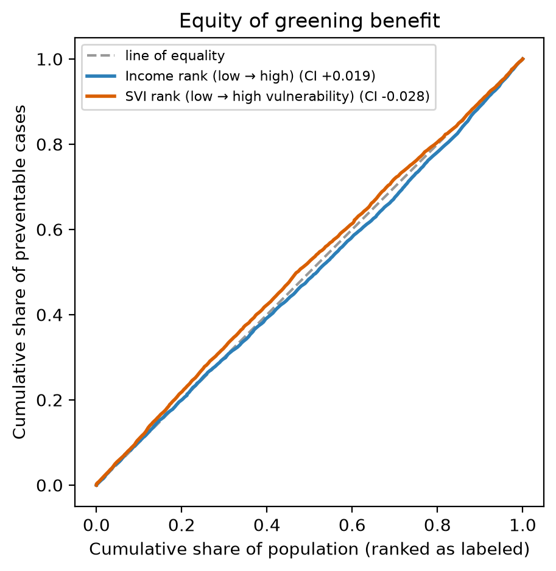

# Equity analysis — who benefits from greening

_241 tracts matched to ACS 2023 income; 239 matched to CDC/ATSDR 2022 SVI._

## Interpretation for decisions

- **Income:** CI **+0.019** — no material gradient detected.
- **Social vulnerability (SVI):** CI **-0.028** — benefits concentrate in less socially vulnerable neighborhoods (equity concern).
- **Bottom line:** the result describes the distribution of modeled benefit, not whether investments reach residents who need them most. Use it alongside project siting, community engagement, and anti-displacement safeguards.

CI ranges from −1 to +1; values within ±0.02 are treated here as no material gradient. For income, negative means benefit is concentrated among lower-income tracts. For SVI, positive means benefit is concentrated among more vulnerable tracts.

Curves above the diagonal indicate concentration among the lower end of the rank. For income that means lower income; for SVI that means lower vulnerability.

## By income decile (1 = lowest income)

| decile | mean tract income | preventable cases / 1,000 adults | % of total cases |
|---:|---:|---:|---:|
| 1 | $-106,637,339 | 6.6 | 7.4% |
| 2 | $81,331 | 5.0 | 8.6% |
| 3 | $104,073 | 14.1 | 10.0% |
| 4 | $118,626 | 4.8 | 10.0% |
| 5 | $137,465 | 4.9 | 10.6% |
| 6 | $152,117 | 5.0 | 10.5% |
| 7 | $167,119 | 4.8 | 10.3% |
| 8 | $183,197 | 5.5 | 11.3% |
| 9 | $207,850 | 5.5 | 10.4% |
| 10 | $242,660 | 5.4 | 10.8% |

## By SVI decile (1 = least vulnerable)

| decile | mean CDC SVI percentile | preventable cases / 1,000 adults | % of total cases |
|---:|---:|---:|---:|
| 1 | 0.062 | 14.2 | 9.5% |
| 2 | 0.154 | 5.8 | 10.7% |
| 3 | 0.268 | 5.5 | 11.0% |
| 4 | 0.378 | 5.2 | 9.2% |
| 5 | 0.461 | 5.1 | 12.8% |
| 6 | 0.539 | 6.0 | 9.7% |
| 7 | 0.628 | 5.2 | 10.1% |
| 8 | 0.710 | 4.4 | 9.7% |
| 9 | 0.796 | 5.1 | 9.4% |
| 10 | 0.945 | 5.2 | 7.9% |

## Method and limits

Population-weighted health concentration indices use preventable cases per adult, not total cases, so large tracts do not mechanically dominate. Income uses ACS 2023 median household income. CDC/ATSDR 2022 SVI uses 16 ACS social factors across four themes; its overall percentile (RPL_THEMES) is ranked nationally, so it is a broader deprivation lens than income alone.

_Sources: Kakwani et al. (1997); CDC/ATSDR Social Vulnerability Index 2022; Wu et al. (2026)._
