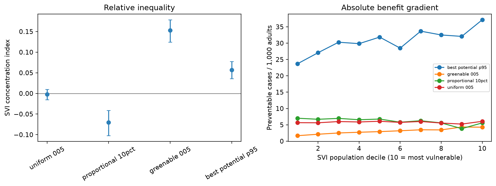

# National SVI equity analysis

County-level benefits are divided by ACS 2023 adult population and ranked by the official CDC/ATSDR 2022 national county SVI percentile. Positive concentration indices and SII slopes mean greater modeled benefit in more socially vulnerable counties; negative values indicate under-serving.

| Scenario | Counties | SVI CI (95% bootstrap interval) | SII cases/1,000 (95% interval) |
|---|---:|---:|---:|
| uniform 005 | 1167 | -0.002 (-0.015, +0.010) | -0.083 (-0.528, +0.347) |
| proportional 10pct | 1167 | -0.070 (-0.102, -0.041) | -2.578 (-3.577, -1.567) |
| greenable 005 | 1167 | +0.153 (+0.124, +0.178) | +2.812 (+2.247, +3.276) |
| best potential p95 | 1167 | +0.057 (+0.036, +0.077) | +10.406 (+6.547, +14.344) |

Figure. Population-weighted relative and absolute SVI gradients across national greening scenarios. Error bars are 95% county-bootstrap intervals.

Interpretation is distributional, not causal. County-level SVI masks within-county inequity, and bootstrap intervals capture county sampling variation rather than epidemiologic, exposure, or cost uncertainty.
