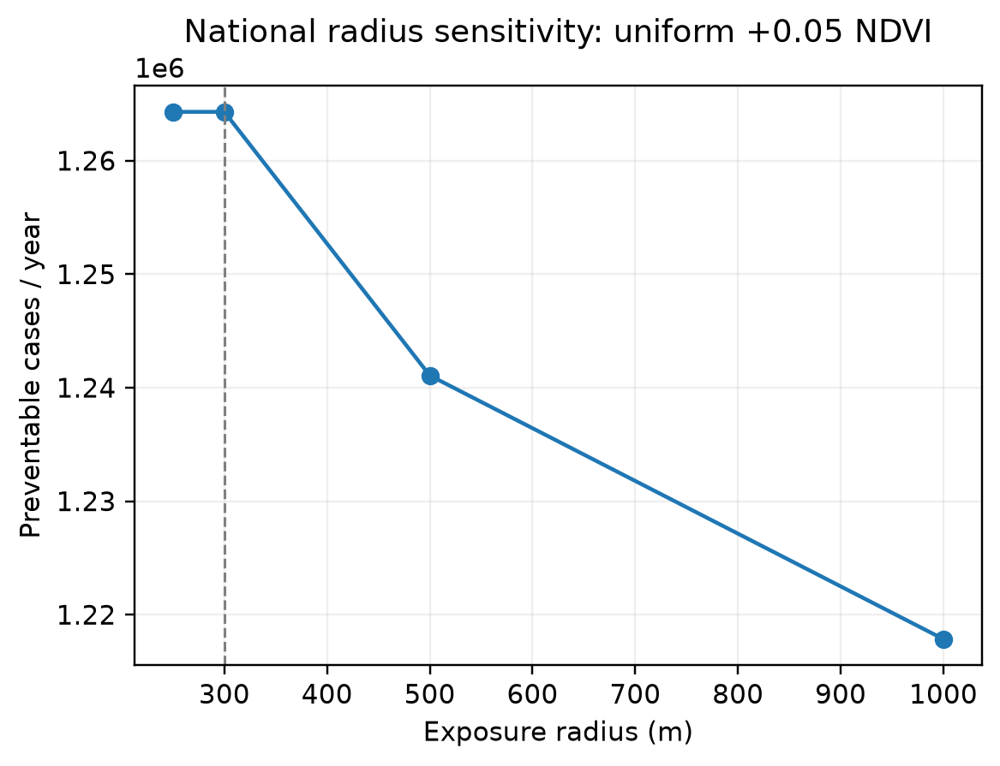

# National exposure-radius sensitivity

| Radius (m) | Counties | Cases/year | Cases/1,000 adults | Relative to 300 m |
|---:|---:|---:|---:|---:|
| 250 | 1167 | 1,264,303 | 5.782 | 1.000 |
| 300 | 1167 | 1,264,304 | 5.782 | 1.000 |
| 500 | 1167 | 1,241,075 | 5.676 | 0.982 |
| 1000 | 1167 | 1,217,851 | 5.570 | 0.963 |

Figure. One-way sensitivity of national modeled cases to the residential greenness averaging radius; all other inputs are fixed.
