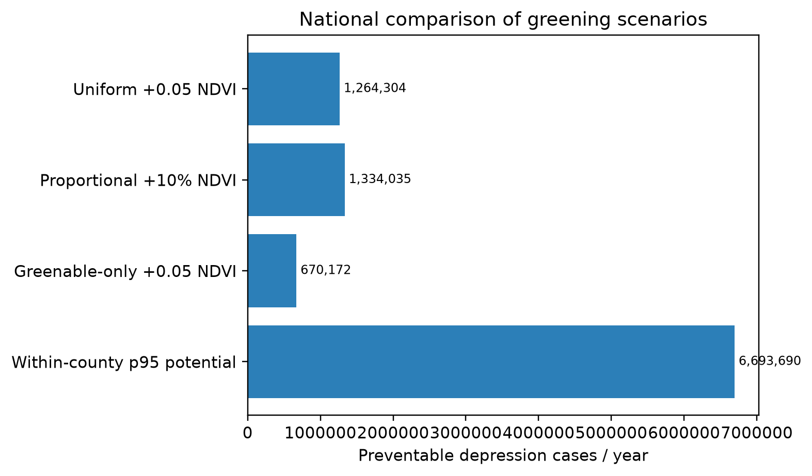

# National scenario comparison

All scenarios use the same 1,167 counties, ACS 2023 adult population, PLACES prevalence, locked national p0/RR, 300 m exposure radius, and $21,280 societal cost per case.

Figure. Annual modeled preventable depression cases under four national greening counterfactuals. The p95 scenario is an aspirational upper bound, not a feasible investment program.

| Scenario | Spatial rule | Cases/year | Cases/1,000 adults | Avoided societal cost/year | Relative to uniform |
|---|---|---:|---:|---:|---:|
| Uniform +0.05 NDVI | Raise every valid pixel by 0.05 NDVI, capped at 0.90. | 1,264,304 | 5.78 | $26,904,386,208 | 1.00 |
| Proportional +10% NDVI | Increase every valid pixel by 10%, capped at 0.90. | 1,334,035 | 6.10 | $28,388,259,810 | 1.06 |
| Greenable-only +0.05 NDVI | Add 0.05 only where baseline NDVI is below 0.60. | 670,172 | 3.07 | $14,261,267,982 | 0.53 |
| Within-county p95 potential | Raise lower pixels to each county's own p95 NDVI. | 6,693,690 | 30.61 | $142,441,723,209 | 5.29 |

Table legend. Values are annual central estimates. All rows use 218,643,229 ACS adults and exactly 1,167 counties. These scenarios differ in greening magnitude and feasibility, so they should not be ranked as equal-budget policy alternatives.
