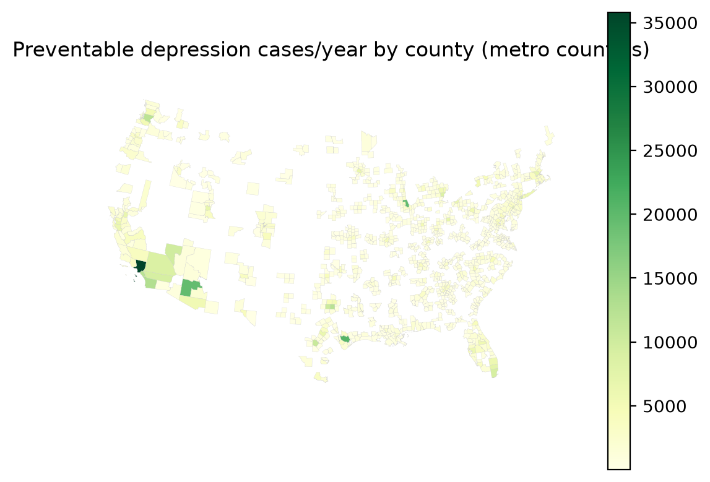

# National results summary — uniform_005

_Generated 2026-08-01 from 1167 county runs in `/Users/yingjiel/Documents/snapp/SNAPP/data/urban-mental-health/runs/national`._

## Headline

- Counties with results: **1167**
- Exposure radius: **300 m**
- Preventable depression cases/year (national): **1,264,304**
- Avoided societal cost/year (national): **$26,904,386,208**
- Implied cost/case $21,280 vs health_cost_rate $21,280 — OK (matches).
- Population was adult-scaled in run_city.py (--adult-fraction, default 0.86), so totals are not the ~20%-overstated all-ages figure.

## Top 20 counties (by preventable cases/year)

| GEOID | county | county features | prevalence tracts | preventable_cases | avoided_cost |
|---|---|---:|---:|---:|---:|
| 06037 | Los Angeles | 1 | 2323 | 35,811 | $762,057,216 |
| 48201 | Harris | 1 | 785 | 20,805 | $442,731,072 |
| 17031 | Cook | 1 | 1314 | 19,611 | $417,329,760 |
| 04013 | Maricopa | 1 | 909 | 19,567 | $416,384,768 |
| 06073 | San Diego | 1 | 626 | 12,981 | $276,229,472 |
| 48113 | Dallas | 1 | 527 | 12,345 | $262,707,712 |
| 06059 | Orange | 1 | 580 | 12,294 | $261,608,512 |
| 53033 | King | 1 | 397 | 11,916 | $253,581,024 |
| 36047 | Kings | 1 | 749 | 10,819 | $230,234,304 |
| 48029 | Bexar | 1 | 362 | 10,719 | $228,110,704 |
| 48439 | Tarrant | 1 | 356 | 10,421 | $221,762,032 |
| 32003 | Clark | 1 | 487 | 9,878 | $210,193,392 |
| 06065 | Riverside | 1 | 452 | 9,306 | $198,036,032 |
| 12086 | Miami-Dade | 1 | 511 | 9,290 | $197,691,696 |
| 06071 | San Bernardino | 1 | 368 | 8,729 | $185,744,336 |
| 26163 | Wayne | 1 | 601 | 8,660 | $184,285,584 |
| 36081 | Queens | 1 | 646 | 8,554 | $182,031,376 |
| 36061 | New York | 1 | 281 | 8,155 | $173,533,344 |
| 42101 | Philadelphia | 1 | 376 | 7,788 | $165,727,280 |
| 12011 | Broward | 1 | 360 | 7,418 | $157,856,560 |

## Top 20 metros (by preventable cases/year)

| metro | counties | preventable_cases | avoided_cost |
|---|---:|---:|---:|
| New York-Newark-Jersey City, NY-NJ-PA | 23 | 78,915 | $1,679,321,620 |
| Los Angeles-Long Beach-Anaheim, CA | 2 | 48,105 | $1,023,665,728 |
| Dallas-Fort Worth-Arlington, TX | 11 | 37,570 | $799,488,160 |
| Chicago-Naperville-Elgin, IL-IN-WI | 14 | 37,448 | $796,883,681 |
| Houston-The Woodlands-Sugar Land, TX | 9 | 31,739 | $675,411,213 |
| Philadelphia-Camden-Wilmington, PA-NJ-DE-MD | 11 | 27,943 | $594,626,698 |
| Atlanta-Sandy Springs-Alpharetta, GA | 29 | 23,676 | $503,834,761 |
| Miami-Fort Lauderdale-Pompano Beach, FL | 3 | 22,639 | $481,756,608 |
| Boston-Cambridge-Newton, MA-NH | 7 | 22,171 | $471,803,800 |
| Seattle-Tacoma-Bellevue, WA | 3 | 22,121 | $470,733,000 |
| Phoenix-Mesa-Chandler, AZ | 2 | 21,540 | $458,381,720 |
| Detroit-Warren-Dearborn, MI | 6 | 21,251 | $452,212,570 |
| Washington-Arlington-Alexandria, DC-VA-MD-WV | 24 | 20,787 | $442,355,521 |
| Minneapolis-St. Paul-Bloomington, MN-WI | 15 | 18,164 | $386,523,472 |
| Riverside-San Bernardino-Ontario, CA | 2 | 18,035 | $383,780,368 |
| San Francisco-Oakland-Berkeley, CA | 5 | 17,676 | $376,138,936 |
| Denver-Aurora-Lakewood, CO | 10 | 14,040 | $298,764,198 |
| Tampa-St. Petersburg-Clearwater, FL | 4 | 13,963 | $297,129,588 |
| Portland-Vancouver-Hillsboro, OR-WA | 7 | 13,923 | $296,280,077 |
| St. Louis, MO-IL | 15 | 13,603 | $289,479,064 |

