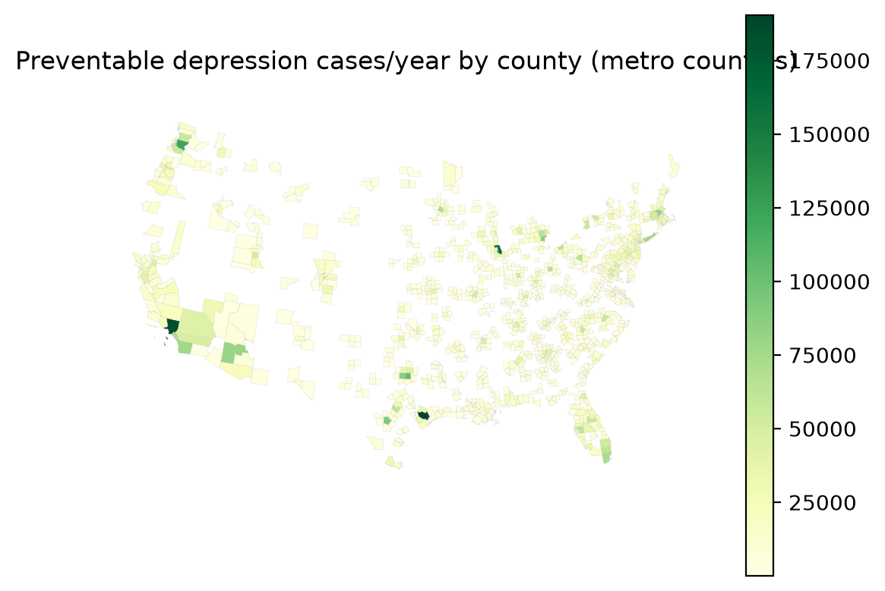

# National results summary — existing_greenness

_Generated 2026-08-01 from 1167 county runs in `/Users/yingjiel/Documents/snapp/SNAPP/data/urban-mental-health/runs/national_existing_greenness`._

## Headline

- Counties with results: **1167**
- Exposure radius: **300 m**
- Preventable depression cases/year (national): **12,733,902**
- Avoided societal cost/year (national): **$270,977,433,363**
- Implied cost/case $21,280 vs health_cost_rate $21,280 — OK (matches).
- Population was adult-scaled in run_city.py (--adult-fraction, default 0.86), so totals are not the ~20%-overstated all-ages figure.

## Top 20 counties (by preventable cases/year)

| GEOID | county | county features | prevalence tracts | preventable_cases | avoided_cost |
|---|---|---:|---:|---:|---:|
| 48201 | Harris | 1 | 785 | 190,393 | $4,051,567,616 |
| 06037 | Los Angeles | 1 | 2323 | 183,895 | $3,913,285,120 |
| 17031 | Cook | 1 | 1314 | 159,743 | $3,399,325,952 |
| 53033 | King | 1 | 397 | 122,482 | $2,606,412,800 |
| 48113 | Dallas | 1 | 527 | 102,837 | $2,188,380,672 |
| 48029 | Bexar | 1 | 362 | 92,260 | $1,963,299,456 |
| 48439 | Tarrant | 1 | 356 | 88,413 | $1,881,432,832 |
| 26163 | Wayne | 1 | 601 | 87,151 | $1,854,571,648 |
| 25017 | Middlesex | 1 | 317 | 83,148 | $1,769,397,120 |
| 04013 | Maricopa | 1 | 909 | 79,965 | $1,701,657,472 |
| 36103 | Suffolk | 1 | 322 | 76,712 | $1,632,437,632 |
| 06073 | San Diego | 1 | 626 | 75,919 | $1,615,558,016 |
| 12086 | Miami-Dade | 1 | 511 | 72,706 | $1,547,176,832 |
| 06059 | Orange | 1 | 580 | 72,541 | $1,543,671,936 |
| 27053 | Hennepin | 1 | 299 | 70,629 | $1,502,992,128 |
| 39049 | Franklin | 1 | 283 | 68,409 | $1,455,749,632 |
| 42003 | Allegheny | 1 | 392 | 64,889 | $1,380,845,696 |
| 26125 | Oakland | 1 | 337 | 64,694 | $1,376,680,576 |
| 39035 | Cuyahoga | 1 | 443 | 64,239 | $1,366,999,168 |
| 12011 | Broward | 1 | 360 | 63,932 | $1,360,479,488 |

## Top 20 metros (by preventable cases/year)

| metro | counties | preventable_cases | avoided_cost |
|---|---:|---:|---:|
| New York-Newark-Jersey City, NY-NJ-PA | 23 | 679,515 | $14,460,082,488 |
| Chicago-Naperville-Elgin, IL-IN-WI | 14 | 361,897 | $7,701,173,900 |
| Dallas-Fort Worth-Arlington, TX | 11 | 322,411 | $6,860,908,632 |
| Houston-The Woodlands-Sugar Land, TX | 9 | 307,250 | $6,538,278,756 |
| Atlanta-Sandy Springs-Alpharetta, GA | 29 | 299,570 | $6,374,848,529 |
| Philadelphia-Camden-Wilmington, PA-NJ-DE-MD | 11 | 292,832 | $6,231,461,560 |
| Boston-Cambridge-Newton, MA-NH | 7 | 262,343 | $5,582,654,816 |
| Los Angeles-Long Beach-Anaheim, CA | 2 | 256,436 | $5,456,957,056 |
| Washington-Arlington-Alexandria, DC-VA-MD-WV | 24 | 249,024 | $5,299,222,538 |
| Seattle-Tacoma-Bellevue, WA | 3 | 235,505 | $5,011,543,552 |
| Detroit-Warren-Dearborn, MI | 6 | 233,143 | $4,961,278,440 |
| Minneapolis-St. Paul-Bloomington, MN-WI | 15 | 208,062 | $4,427,561,188 |
| Miami-Fort Lauderdale-Pompano Beach, FL | 3 | 190,338 | $4,050,400,640 |
| St. Louis, MO-IL | 15 | 156,722 | $3,335,044,692 |
| Charlotte-Concord-Gastonia, NC-SC | 11 | 153,695 | $3,270,624,058 |
| Portland-Vancouver-Hillsboro, OR-WA | 7 | 149,680 | $3,185,200,012 |
| Tampa-St. Petersburg-Clearwater, FL | 4 | 140,933 | $2,999,062,032 |
| Baltimore-Columbia-Towson, MD | 7 | 140,088 | $2,981,067,136 |
| Nashville-Davidson--Murfreesboro--Franklin, TN | 13 | 133,779 | $2,846,811,492 |
| Pittsburgh, PA | 7 | 130,530 | $2,777,685,008 |

