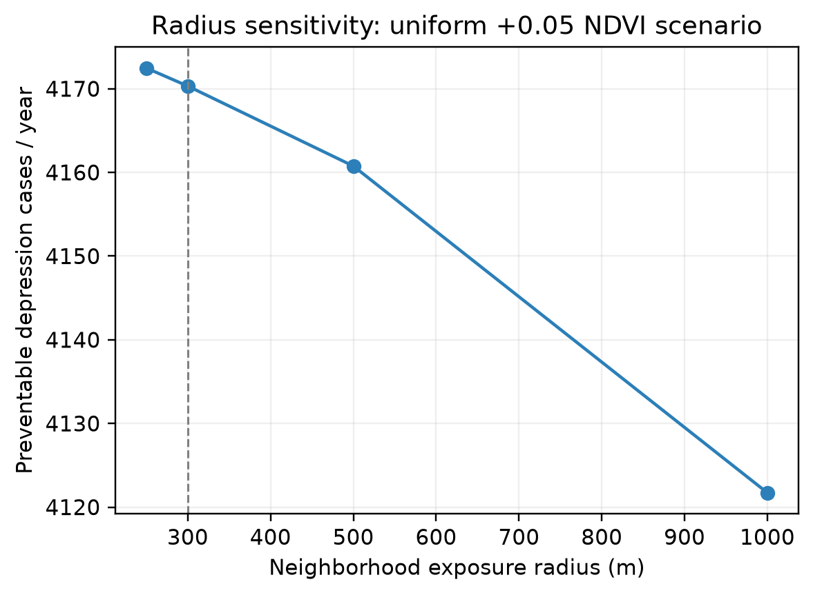

# Exposure-radius sensitivity

All rows use the calibrated SF adult population, the uniform +0.05 NDVI scenario, and the same epidemiologic and cost assumptions. Only the neighborhood averaging radius changes.

| Radius (m) | Preventable cases/year | Cases/1,000 adults | Relative to 300 m |
|---:|---:|---:|---:|
| 250 | 4,172.5 | 5.822 | 1.001 |
| 300 | 4,170.3 | 5.819 | 1.000 |
| 500 | 4,160.8 | 5.805 | 0.998 |
| 1000 | 4,121.7 | 5.751 | 0.988 |

Figure. One-way sensitivity of the uniform +0.05 NDVI scenario to the residential greenness averaging radius.

Interpretation: this is a model-structure sensitivity, not an independent epidemiologic confidence interval. The 300 m result remains the primary specification.
