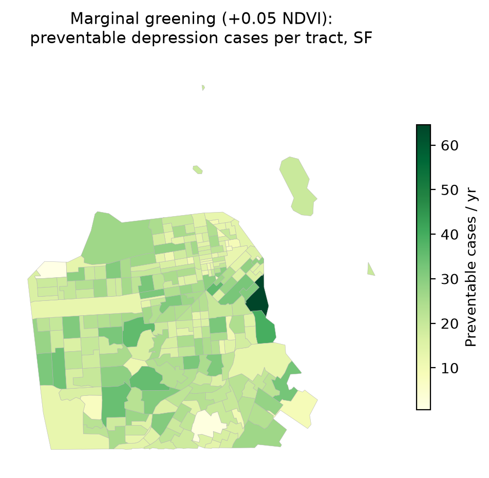
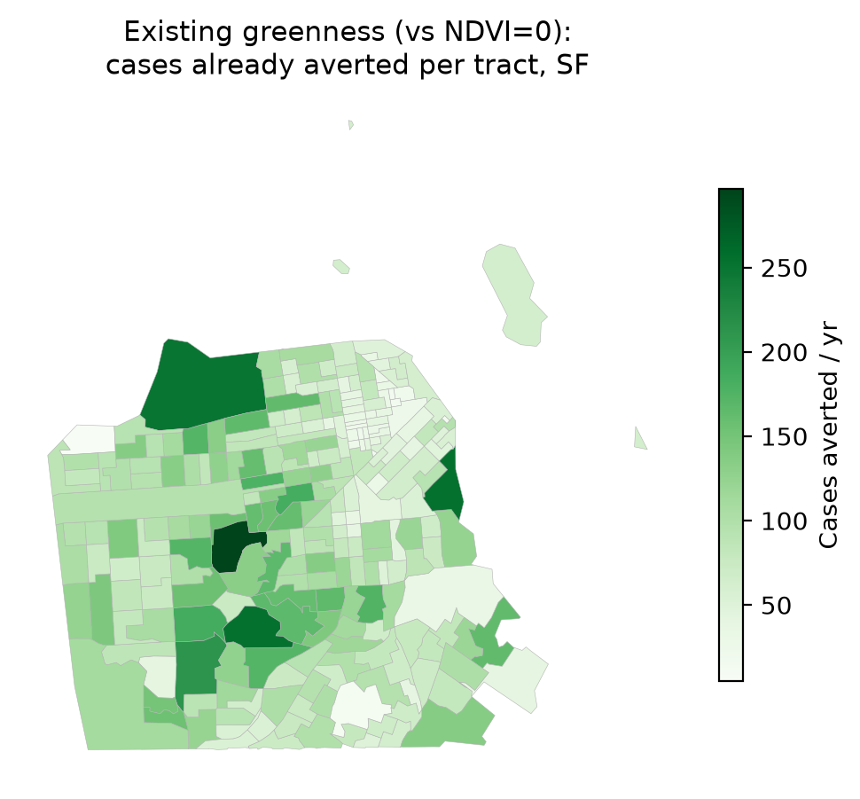
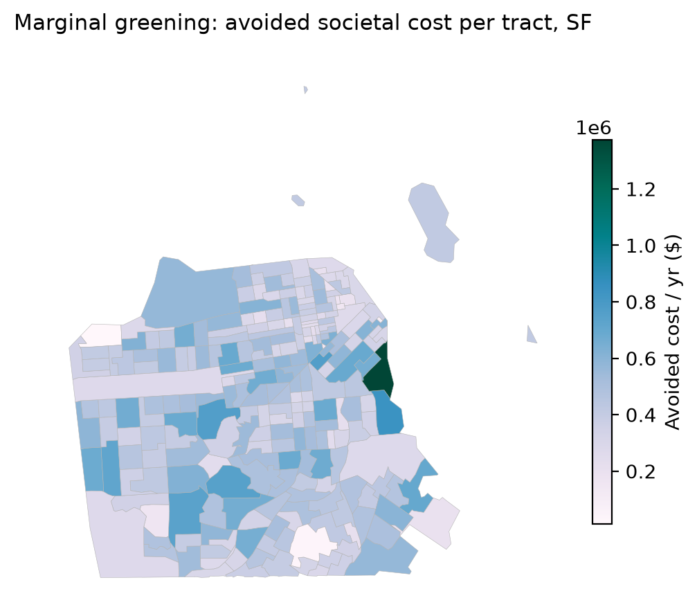
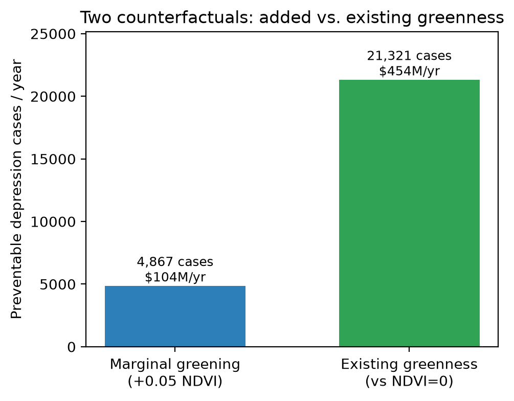
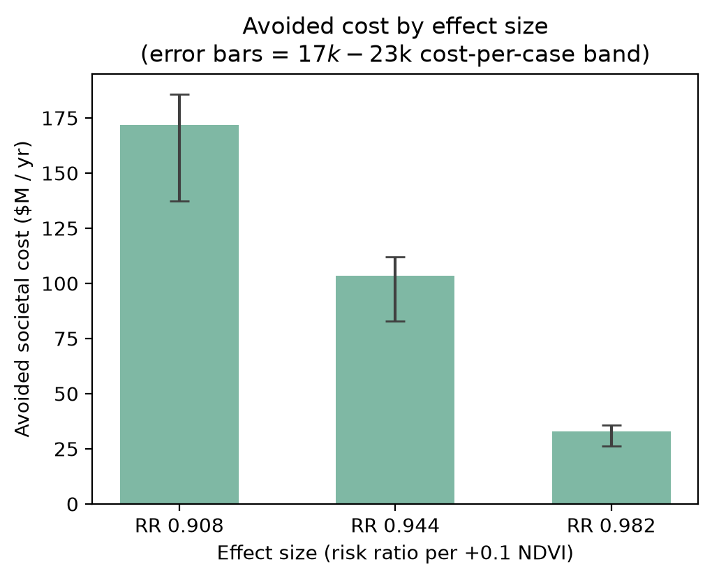

# Model results summary (SF)

_Generated 2026-07-13 from `preventable_cases_cost_sum_sf_2024.csv`._

## Headline

- Preventable depression cases/year: **4,867**
- Avoided societal cost/year: **$103,573,424**
- Tracts analyzed: **241**
- Per-tract cases: mean 20.2, median 19.6, min 0.6, max 64.5

## QA checks

- Implied cost/case $21,280 vs health_cost_rate $21,280 — OK (matches).
- Reminder: baseline cases should use ADULT population (prevalence is adult); if population wasn't adult-scaled, totals are overstated ~20%.
- Greening scenario and effect size are assumptions — read with the sensitivity range below, not as point truth.

## Two counterfactuals

Two distinct questions, reported side by side:

- **Marginal greening** (current NDVI -> +scenario): **4,867** preventable cases/yr, **$103,573,424**/yr.
- **Total value of existing greenness** (bare NDVI=0 -> current): **21,321** cases/yr already averted, **$453,715,456**/yr.

The first is the benefit of *adding* greenness (policy-relevant marginal effect); the second is an ecosystem-service accounting of greenness already present. The NDVI=0 figure extrapolates the exposure-response well beyond observed data, so treat it as an upper-bound accounting number, not a prediction of what removing all vegetation would do.

## Context & reference numbers

Putting the San Francisco result in perspective:

- Preventable cases are **0.59%** of total population (5.9 per 1,000 residents).
- Estimated adult depression pool ≈ **146,212** (716,727 adults × 20.4%); marginal greening averts **3.3%** of it, and existing greenness accounts for **15%**.
- Avoided societal cost is **0.041%** of San Francisco GDP (~$250B); existing-greenness value is **0.18%** of GDP.
- Avoided cost per resident: **$125/year**.
- (Population/GDP anchors live in config.yaml `context:` — update per city; GDP is an approximate BEA figure.)

## Baseline & population check

- Marginal preventable fraction (model): **2.84%** of baseline cases at +0.05 NDVI (RR 0.944).
- Model-implied baseline depression cases: **171,359** (= preventable / preventable-fraction).
- Census-based adult depression pool: **146,212** (716,727 adults × 20.4%).
- ⚠️ Model baseline is **1.17×** the census pool → the population raster likely sums ~839,995 (vs 716,727 adults). Check that population was adult-scaled AND clipped to the AOI polygon (not a bounding box). Fixing it scales the headline down by ~15%.

## Literature benchmark

- **Greening magnitude.** Our +0.05 NDVI scenario is close to the Barcelona "Eixos Verds" green-corridor plan, whose HIA modelled an average **+0.059 NDVI** — so the dose is realistic, not arbitrary.
- **Method precedent.** A 2025 global study (J. Global Health) uses the same design — scenario-based preventable depression burden from greenness via a pooled meta-analytic OR and population-attributable fractions — so the approach is established and publishable.
- **Effect magnitude.** Published per-0.1-NDVI depression reductions cluster around **5-8%**; our risk-ratio gives **5.6%** per 0.1 NDVI — at the conservative end, as expected after the OR->RR correction (the higher figures use the OR directly).
- **Takeaway.** The preventable *fraction* is defensible and literature-consistent; the absolute count depends on the population baseline (see check above).

_Refs: Liu et al. 2023 Environ. Res. 231:116303; Barcelona Eixos Verds HIA (Mueller et al., Environ. Int. 2023); JOGH 2025;15:04280._

## Sensitivity (effect_size × cost)

| effect_size | preventable_cases | cost_low | cost_central | cost_high |
|---|---:|---:|---:|---:|
| 0.908 | 8,073 | $137,234,774 | $171,785,647 | $185,670,577 |
| 0.944 | 4,867 | $82,741,930 | $103,573,428 | $111,944,964 |
| 0.982 | 1,549 | $26,337,096 | $32,967,848 | $35,632,542 |

## p0 sensitivity (OR->RR conversion)

Baseline risk p0 used: **0.204** (population-weighted PLACES prevalence); central OR 0.931 -> RR 0.9443. The RR is nearly flat in p0, but preventable cases scale with -ln(RR), so they move ~±6% per 0.05 change in p0 — hence pinning p0 to the data (compute_p0.py):

| p0 | RR | approx. preventable cases |
|---:|---:|---:|
| 0.10 | 0.9375 | 5,483 |
| 0.15 | 0.9407 | 5,187 |
| 0.20 | 0.9440 | 4,891 |
| 0.25 | 0.9473 | 4,593 |
| 0.30 | 0.9507 | 4,295 |

## Figures

