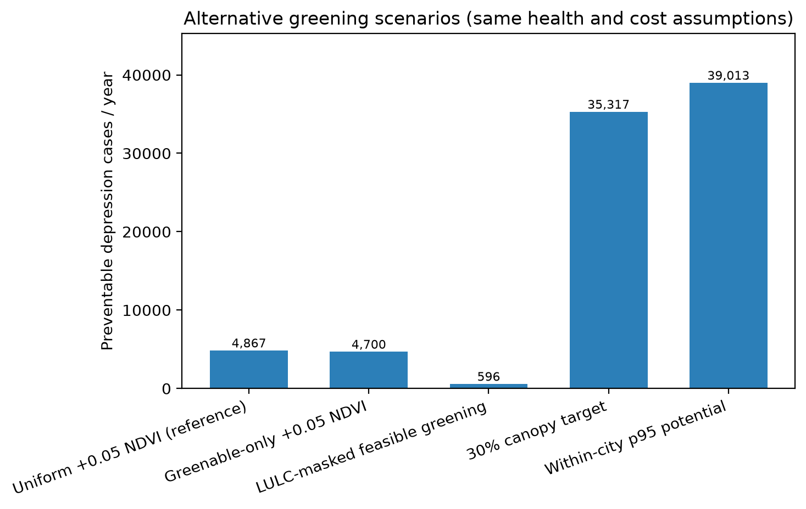

# San Francisco: health benefits of urban greenery

_Generated 2026-07-13._

This report estimates how much depression could be prevented — and how much money saved — by increasing greenery (street trees, parks, vegetation) across San Francisco. It combines satellite greenery (the NDVI index), local adult depression rates (CDC PLACES) and where people live (WorldPop) via the InVEST Urban Mental Health model. Key terms are defined in the glossary at the end.

## In brief

Adding a modest amount of greenery across San Francisco — a **+0.05 rise in the NDVI greenery index**, roughly the scale of Barcelona's green-corridor plan — could prevent about **4,867 cases of depression per year** (95% CI: 1,549–8,073), worth roughly **$104 million** in avoided societal cost. Separately, the greenery San Francisco *already has* is estimated to prevent about **21,321 cases per year** versus a bare city.

## Headline numbers

- **4,867** depression cases prevented per year (95% CI: 1,549–8,073) (from added greenery)
- **$103,573,424** avoided societal cost per year (95% CI: $33–$172M)
- Neighborhoods analyzed: **241** census tracts
- Per neighborhood: **20** cases prevented on average (range 1–65).

## Two ways to value greenery

We answer two different questions:

1. **Adding greenery** (the policy question) — if greenery rose by +0.05 NDVI everywhere, about **4,867** cases/yr ($104M) would be prevented.
2. **Greenery we already have** (its standing value) — versus a bare, vegetation-free city, today's greenery already prevents about **21,321** cases/yr ($454M).

The first guides investment; the second is an accounting of a benefit the city already enjoys. The "bare city" is a what-if benchmark, not a real prospect — read it as an upper bound.

The two scenarios compared: depression cases prevented per year.

**Where the benefits fall** — darker means more cases prevented:

<table><tr>
<td width="50%"> Adding greenery (+0.05 NDVI)</td>
<td width="50%"> Greenery already present</td>
</tr></table>

## Alternative investment scenarios

These scenarios use the same exposure-response, baseline depression, population, and societal-cost assumptions. They differ only in where and how much greening is allowed; therefore, their differences are scenario assumptions rather than independent statistical estimates.

Preventable cases under alternative greening scenarios.

| Scenario | Spatial rule | Preventable cases / yr | Avoided societal cost / yr |
|---|---|---:|---:|
| Uniform +0.05 NDVI (reference) | Raise every valid pixel by 0.05 NDVI; reference only, not physically feasible everywhere. | 4,867 | $103,573,428 |
| Greenable-only +0.05 NDVI | Raise pixels below NDVI 0.60 by 0.05; data-light feasibility screen. | 4,700 | $100,026,235 |
| LULC-masked feasible greening | Raise eligible NLCD developed-open, low-intensity, and barren land toward NDVI 0.65. | 596 | $12,681,043 |
| 30% canopy target | Raise each tract toward the NDVI equivalent of 30% tree canopy; policy target. | 35,317 | $751,537,448 |
| Within-city p95 potential | Raise lower-NDVI pixels to the city's own 95th-percentile NDVI; ambitious upper-bound potential. | 39,013 | $830,202,625 |

The LULC-masked and canopy-target scenarios are the most decision-relevant; the uniform and p95 scenarios bracket a simple reference and an ambitious upper bound.

## Where the benefits concentrate

Benefits are largest where many people live near low greenery and depression rates are high. The map shows avoided cost by neighborhood; the scatter shows that higher-prevalence neighborhoods gain more from greening.

Avoided societal cost per neighborhood, from added greenery.

## Putting the numbers in perspective

To make the San Francisco result intuitive:

- Preventable cases are **0.59%** of total population (5.9 per 1,000 residents).
- Preventable **rate: 6.8 cases per 1,000 adults** — the age-structure-independent metric for comparing places (see PAF note below).
- Estimated adult depression pool ≈ **146,212** (716,727 adults × 20.4%); marginal greening averts **3.3%** of it, and existing greenness accounts for **15%**.
- Avoided societal cost is **0.041%** of San Francisco GDP (~$250B); existing-greenness value is **0.18%** of GDP.
- Avoided cost per resident: **$125/year**.
- (Population/GDP anchors live in config.yaml `context:` — update per city; GDP is an approximate BEA figure.)

## How reliable are these numbers?

Two sources of spread, and they are different in kind:

- **Statistical 95% CI (cases).** The effect-size bounds (RR 0.908–0.982) are the Liu et al. (2023) odds-ratio 95% CI, converted to risk ratios. Propagating them gives the headline confidence interval of 1,549–8,073 cases.
- **Cost scenario band ($17k–$23k per case).** This is a range of defensible cost-of-illness anchors, *not* a statistical CI — treat it as a what-if range.

The chart and table below show both together.

How avoided cost changes with the effect size and cost-per-case range.

| effect size (RR) | cases prevented | cost (low) | cost (central) | cost (high) |
|---|---:|---:|---:|---:|
| 0.908 | 8,073 | $137,234,774 | $171,785,647 | $185,670,577 |
| 0.944 | 4,867 | $82,741,930 | $103,573,428 | $111,944,964 |
| 0.982 | 1,549 | $26,337,096 | $32,967,848 | $35,632,542 |

### Sensitivity to the baseline-risk assumption (p0)

Baseline risk p0 used: **0.204** (population-weighted PLACES prevalence); central OR 0.931 -> RR 0.9443. The RR is nearly flat in p0, but preventable cases scale with -ln(RR), so they move ~±6% per 0.05 change in p0 — hence pinning p0 to the data (compute_p0.py):

| p0 | RR | approx. preventable cases |
|---:|---:|---:|
| 0.10 | 0.9375 | 5,483 |
| 0.15 | 0.9407 | 5,187 |
| 0.20 | 0.9440 | 4,891 |
| 0.25 | 0.9473 | 4,593 |
| 0.30 | 0.9507 | 4,295 |

### Baseline, PAF & population check

- **Population-attributable fraction (PAF): 2.84%** — the share of baseline depression preventable at +0.05 NDVI (RR 0.944). Dimensionless, so it is directly comparable across places regardless of size or age structure.
- Model-implied baseline depression cases: **171,359** (= preventable / PAF).
- Census-based adult depression pool: **146,212** (716,727 adults × 20.4%).
- ⚠️ Model baseline is **1.17×** the census pool → the population raster likely sums ~839,995 (vs 716,727 adults). Check that population was adult-scaled AND clipped to the AOI polygon (not a bounding box). Fixing it scales the headline down by ~15%.

## How this compares with other studies

- **Greening magnitude.** Our +0.05 NDVI scenario is close to the Barcelona "Eixos Verds" green-corridor plan, whose health impact assessment modelled an average **+0.059 NDVI** (Vidal Yáñez et al., 2023) — so the dose is realistic, not arbitrary.
- **Method precedent.** Wu et al. (2025) use the same design — scenario-based preventable depression burden from greenness via a pooled meta-analytic odds ratio and population-attributable fractions — so the approach is established and publishable.
- **Effect magnitude.** Published per-0.1-NDVI depression reductions cluster around **5–8%**; our risk ratio gives **5.6%** per 0.1 NDVI (converted from the Liu et al., 2023 odds ratio) — at the conservative end, as expected after the OR→RR correction (the higher figures use the OR directly).
- **Takeaway.** The preventable *fraction* is defensible and literature-consistent; the absolute count depends on the population baseline (see check above).

_Sources: Liu et al. (2023); Vidal Yáñez et al. (2023); Wu et al. (2025) — see References._

## Data-quality checks

- Cost bookkeeping: implied $21,280/case vs configured $21,280 — OK.
- Population is adult-scaled (depression rates are for adults); the baseline check above confirms it against census figures.
- The greening scenario and effect size are assumptions — read the headline with the ranges above, not as a single certain number.
- **Cross-place comparability:** we report the **PAF** and **cases per 1,000 adults**, which are independent of a place's size and age structure. A full *age-standardized* rate (as in Wu et al., 2026) is **not feasible here**: CDC PLACES gives a single adult (18+) depression rate per tract, not 5-year age-specific rates, and the effect size isn't age-specific — so the PAF and the crude adult rate are the appropriate comparators.

## Glossary

- **NDVI** — a satellite greenery index from 0 to 1; higher = more vegetation. A +0.05 rise is a modest, realistic increase.
- **Prevented (preventable) cases** — depression cases expected *not* to occur when greenery increases, based on published greenery–depression studies.
- **Societal cost** — the full annual cost of a depression case (healthcare plus lost productivity), not just medical bills.
- **Census tract** — a neighborhood-sized area (~4,000 people) used for the maps.
- **Effect size (risk ratio)** — how much depression risk changes per +0.1 NDVI.

## References

Centers for Disease Control and Prevention. (2024). *PLACES: Local data for better health (census tract and county data)* [Data set]. https://www.cdc.gov/places

Greenberg, P. E., Fournier, A.-A., Sisitsky, T., Simes, M., Berman, R., Koenigsberg, S. H., & Kessler, R. C. (2021). The economic burden of adults with major depressive disorder in the United States (2010 and 2018). *PharmacoEconomics, 39*(6), 653–665. https://doi.org/10.1007/s40273-021-01019-4

Greenberg, P. E., Fournier, A.-A., Sisitsky, T., Simes, M., Berman, R., Koenigsberg, S. H., & Kessler, R. C. (2023). The economic burden of adults with major depressive disorder in the United States (2019). *Advances in Therapy, 40*(9), 4460–4479. https://doi.org/10.1007/s12325-023-02622-x

König, H., König, H.-H., & Konnopka, A. (2020). The excess costs of depression: A systematic review and meta-analysis. *Epidemiology and Psychiatric Sciences, 29*, Article e30. https://doi.org/10.1017/S2045796019000180

Liu, Z., Chen, X., Cui, H., Ma, Y., Gao, N., Li, X., Meng, X., Lin, H., Abudou, H., Guo, L., & Liu, Q. (2023). Green space exposure on depression and anxiety outcomes: A meta-analysis. *Environmental Research, 231*(Pt 3), Article 116303. https://doi.org/10.1016/j.envres.2023.116303

Natural Capital Project. (2024). *InVEST: Integrated Valuation of Ecosystem Services and Tradeoffs (Urban Mental Health model)* [Computer software]. Stanford University. https://naturalcapitalproject.stanford.edu/software/invest

U.S. Bureau of Economic Analysis. (2024). *Gross domestic product by county* [Data set]. https://www.bea.gov/data/gdp/gdp-county-metro-and-other-areas

U.S. Census Bureau. (2024). *Cartographic boundary files (2024 vintage)* [Data set]. https://www.census.gov/geographies/mapping-files/time-series/geo/cartographic-boundary.html

Vidal Yáñez, D., Pereira, E., Cirach, M., Daher, C., Nieuwenhuijsen, M., & Mueller, N. (2023). An urban green space intervention with benefits for mental health: A health impact assessment of the Barcelona "Eixos Verds" Plan. *Environment International, 174*, Article 107880. https://doi.org/10.1016/j.envint.2023.107880

WorldPop. (2025). *Global 2015–2030 constrained population estimates (Global2), Release R2025A* [Data set]. University of Southampton. https://hub.worldpop.org/geodata/listing?id=135

Wu, J., Di, W., Ruan, J., Li, S., Ying, J., Zhou, J., Rudan, I., & Song, P. (2025). The global, regional and national preventable burden of depression attributable to greenness and inequalities: A scenario-based health impact analysis. *Journal of Global Health, 15*, Article 04280. https://doi.org/10.7189/jogh.15.04280

Wu, J., Ruan, J., Di, W., Ying, J., Zhou, J., Luo, Z., Rudan, I., & Song, P. (2026). The global burden of hypertension preventable by urban greenness. *Nature Health.* https://doi.org/10.1038/s44360-026-00090-5

Zhang, J., & Yu, K. F. (1998). What's the relative risk? A method of correcting the odds ratio in cohort studies of common outcomes. *JAMA, 280*(19), 1690–1691. https://doi.org/10.1001/jama.280.19.1690

