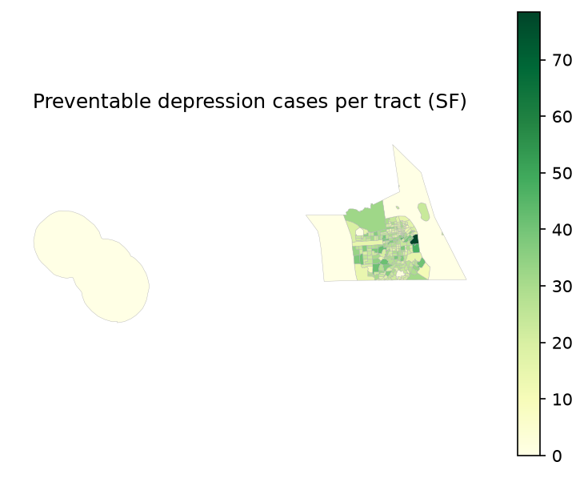

# Model results summary (SF)

_Generated 2026-07-13 from `preventable_cases_cost_sum_sf_2024.csv`._

## Headline

- Preventable depression cases/year: **5,814**
- Avoided societal cost/year: **$123,720,361**
- Tracts analyzed: **244**
- Per-tract cases: mean 23.8, median 23.1, min 0.0, max 78.5

## QA checks

- Implied cost/case $21,280 vs health_cost_rate $21,280 — OK (matches).
- Reminder: baseline cases should use ADULT population (prevalence is adult); if population wasn't adult-scaled, totals are overstated ~20%.
- Greening scenario and effect size are assumptions — read with the sensitivity range below, not as point truth.

## Two counterfactuals

Two distinct questions, reported side by side:

- **Marginal greening** (current NDVI -> +scenario): **5,814** preventable cases/yr, **$123,720,361**/yr.
- **Total value of existing greenness** (bare NDVI=0 -> current): **25,469** cases/yr already averted, **$541,976,264**/yr.

The first is the benefit of *adding* greenness (policy-relevant marginal effect); the second is an ecosystem-service accounting of greenness already present. The NDVI=0 figure extrapolates the exposure-response well beyond observed data, so treat it as an upper-bound accounting number, not a prediction of what removing all vegetation would do.

## Sensitivity (effect_size × cost)

| effect_size | preventable_cases | cost_low | cost_central | cost_high |
|---|---:|---:|---:|---:|
| 0.908 | 9,643 | $0 | $0 | $0 |
| 0.944 | 5,814 | $0 | $0 | $0 |
| 0.982 | 1,851 | $0 | $0 | $0 |

## p0 sensitivity (OR->RR conversion)

Baseline risk p0 used: **0.204** (population-weighted PLACES prevalence); central OR 0.931 -> RR 0.9443. The RR is nearly flat in p0, but preventable cases scale with -ln(RR), so they move ~±6% per 0.05 change in p0 — hence pinning p0 to the data (compute_p0.py):

| p0 | RR | approx. preventable cases |
|---:|---:|---:|
| 0.10 | 0.9375 | 6,550 |
| 0.15 | 0.9407 | 6,197 |
| 0.20 | 0.9440 | 5,842 |
| 0.25 | 0.9473 | 5,487 |
| 0.30 | 0.9507 | 5,130 |

