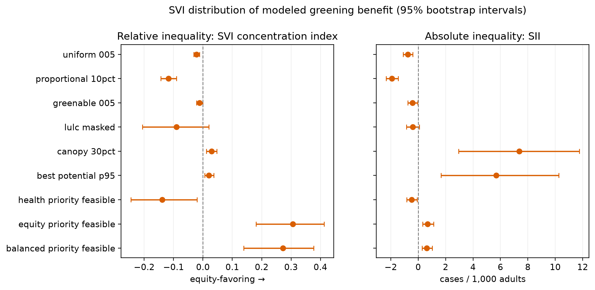
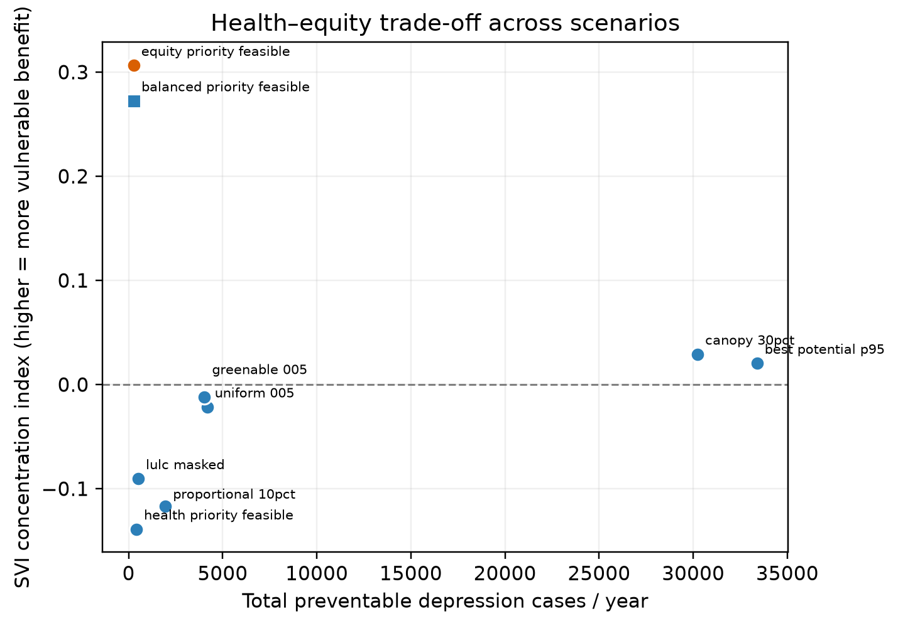
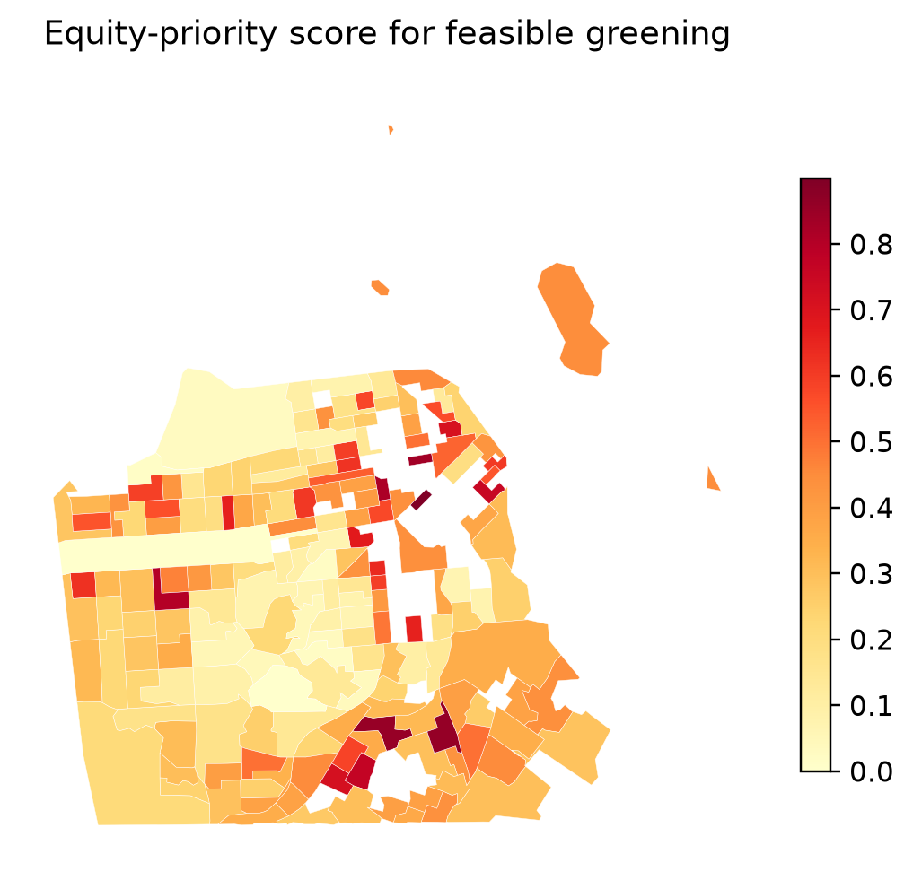
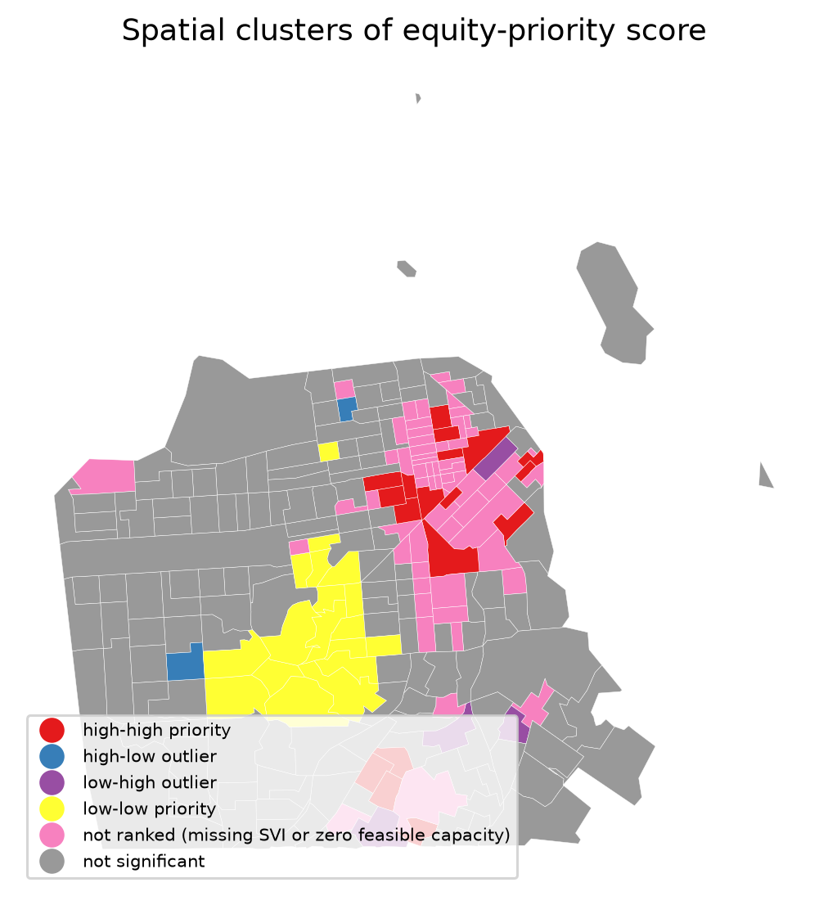

# San Francisco: health benefits of urban greenery

_Generated 2026-07-30._

This report estimates how much **PLACES-defined diagnosed depressive disorder** could be prevented — and how much money saved — by increasing greenery (street trees, parks, vegetation) across San Francisco. It combines satellite greenery (the NDVI index), local adult depression rates (CDC PLACES) and where people live (WorldPop) via the InVEST Urban Mental Health model. PLACES measures adults ever told by a health professional that they had a depressive disorder; it is not strict current MDD prevalence. Key terms are defined in the glossary at the end.

## In brief

Adding a modest amount of greenery across San Francisco — a **+0.05 rise in the NDVI greenery index**, roughly the scale of Barcelona's green-corridor plan — could prevent about **4,170 cases of depression per year** (95% CI: 1,364–6,956), worth roughly **$89 million** in avoided societal cost. Separately, the greenery San Francisco *already has* is estimated to prevent about **18,257 cases per year** versus a bare city.

## Headline numbers

- **4,170** depression cases prevented per year (95% CI: 1,364–6,956) (from added greenery)
- **$88,744,376** avoided societal cost per year (95% CI: $29–$148M)
- Neighborhoods analyzed: **241** census tracts
- Per neighborhood: **17** cases prevented on average (range 1–55).

## Scenario comparison

The 9 investment scenarios use the same exposure-response, baseline depression, population, and societal-cost assumptions; they differ only in where and how much greening is allowed. The existing-greenness row is included for context, but it is an accounting counterfactual (today's greenness versus a bare city), not an investment option or a plausible removal forecast.

**Table 1. Scenario comparison with common population and economic anchors.**

| Scenario | Spatial rule | Cases / yr | Cases / 1,000 adults | Share of adult depression pool | Avoided cost / yr | Cost / resident / yr | Share of city GDP |
|---|---|---:|---:|---:|---:|---:|---:|
| Uniform +0.05 NDVI (reference) | Raise every valid pixel by 0.05 NDVI; reference only, not physically feasible everywhere. | 4,170 | 5.8 | 3.0% | $88,744,385 | $107 | 0.035% |
| Proportional +10% NDVI | See config.yaml. | 1,952 | 2.7 | 1.4% | $41,533,788 | $50 | 0.017% |
| Greenable-only +0.05 NDVI | Raise pixels below NDVI 0.60 by 0.05; data-light feasibility screen. | 4,028 | 5.6 | 2.9% | $85,705,392 | $103 | 0.034% |
| LULC-masked feasible greening | Raise eligible NLCD developed-open, low-intensity, and barren land toward NDVI 0.65. | 511 | 0.7 | 0.4% | $10,866,473 | $13 | 0.004% |
| 30% canopy target | Raise each tract toward the NDVI equivalent of 30% tree canopy; policy target. | 30,227 | 42.2 | 22.1% | $643,227,651 | $775 | 0.257% |
| Within-city p95 potential | Raise lower-NDVI pixels to the city's own 95th-percentile NDVI; ambitious upper-bound potential. | 33,387 | 46.6 | 24.4% | $710,470,788 | $856 | 0.284% |
| Health-priority feasible allocation | Allocate the same feasible-NDVI budget first to tracts with highest modeled cases per feasible NDVI increment. | 408 | 0.6 | 0.3% | $8,685,521 | $10 | 0.003% |
| Equity-priority feasible allocation | Allocate the same feasible-NDVI budget using health need, SVI, and low-greenness priority. | 265 | 0.4 | 0.2% | $5,641,954 | $7 | 0.002% |
| Balanced feasible allocation | Allocate the same feasible-NDVI budget using equal health and equity priority weights. | 276 | 0.4 | 0.2% | $5,878,547 | $7 | 0.002% |
| Existing greenness (accounting counterfactual) | Current NDVI compared with NDVI = 0; upper-bound stock value, not an investment scenario. | 18,257 | 25.5 | 13.3% | $388,500,000 | $468 | 0.155% |

Table 1 legend. All values are annual central estimates, not confidence intervals. Cases per 1,000 adults use 716,727 adults. The adult depression pool is 136,927 (19.1% prevalence). Cost per resident uses 830,235 residents; GDP shares use $250B. Costs use the configured $21,280 per case. The existing-greenness row is an upper-bound accounting comparison, not an investment scenario.

**Read these as two groups, not one ranking — they are not on a common effort scale.** The *budget-matched, feasible* scenarios (LULC-masked and the health-/equity-/balanced-priority allocations) are the decision-relevant options: each greens a comparable, realistically achievable amount of land, so their prevented-case numbers *are* directly comparable and answer 'where should a fixed greening budget go?'. The *reference and aspirational* scenarios (uniform +0.05, proportional +10%, within-city p95, 30% canopy) instead raise NDVI broadly or to a ceiling; they bracket a simple reference and an upper envelope of what is biophysically possible, and their much larger totals reflect far more greening, not a better use of the same resources. Compare within a group, not across.

## Where the benefits concentrate

Benefits are largest where many people live near low greenery and depression rates are high. The map shows avoided cost by neighborhood; the scatter shows that higher-prevalence neighborhoods gain more from greening.

## Equity implications

We assess the distribution of the modeled *rate* of prevented cases using two complementary rankings: median household income and CDC/ATSDR Social Vulnerability Index (SVI). This is a distributional diagnostic, not evidence that a real project will reach vulnerable residents without deliberate siting and implementation.

| Equity lens | Concentration index | Interpretation |
|---|---:|---|
| Median household income (low → high) | +0.019 | no material gradient detected |
| CDC/ATSDR SVI (low → high vulnerability) | -0.028 | benefits concentrate in less socially vulnerable neighborhoods (equity concern) |

For income, a negative index favors lower-income tracts. For SVI, a positive index favors more socially vulnerable tracts. Values within ±0.02 are treated as no material gradient.

Each curve is ranked separately; above the diagonal means concentration toward the lower end of that specific rank.

## Advanced distributional equity

This extension reports **relative inequality** (concentration index, CI) and **absolute inequality** (Slope Index of Inequality, SII) in modeled preventable cases per 1,000 adults. For SVI, positive CI/SII means the modeled benefit is more concentrated in socially vulnerable tracts. Intervals are 95% tract-bootstrap intervals; they quantify geographic sampling variation but do not replace the health-effect sensitivity analysis.

**Table 3. SVI distribution of benefit by scenario.**

| Scenario | SVI CI (95% interval) | SII cases / 1,000 adults (95% interval) | Interpretation |
|---|---:|---:|---|
| Uniform +0.05 NDVI (reference) | -0.022 (-0.031, -0.011) | -0.75 (-1.09, -0.40) | vulnerability-under-serving |
| Proportional +10% NDVI | -0.117 (-0.144, -0.091) | -1.91 (-2.35, -1.47) | vulnerability-under-serving |
| Greenable-only +0.05 NDVI | -0.012 (-0.022, -0.001) | -0.41 (-0.75, -0.03) | no material gradient |
| LULC-masked feasible greening | -0.090 (-0.206, +0.020) | -0.39 (-0.86, +0.09) | vulnerability-under-serving |
| 30% canopy target | +0.029 (+0.012, +0.047) | +7.36 (+2.95, +11.76) | equity-promoting |
| Within-city p95 potential | +0.020 (+0.006, +0.037) | +5.69 (+1.68, +10.25) | equity-promoting |
| Health-priority feasible allocation | -0.139 (-0.246, -0.020) | -0.47 (-0.84, -0.08) | vulnerability-under-serving |
| Equity-priority feasible allocation | +0.306 (+0.181, +0.413) | +0.68 (+0.32, +1.12) | equity-promoting |
| Balanced feasible allocation | +0.272 (+0.138, +0.377) | +0.63 (+0.28, +1.02) | equity-promoting |

Table 3 legend. CI is a relative distribution measure; SII is the modeled difference between the least and most socially vulnerable ends of the population-weighted SVI rank. Both use adult-population weights.

Figure 3. Relative and absolute SVI inequality across scenarios; error bars show 95% tract-bootstrap intervals.

Figure 4. Health–equity trade-off. Higher vertical position means more modeled benefit reaches higher-SVI tracts.

Figure 5. Equity-priority score for feasible greening, combining modeled cases per feasible NDVI increment, SVI, and baseline greenness deficit.

Figure 6. Local spatial clusters of the equity-priority score; this is a screening map for place-based planning, not a causal inference map.

## Interpreting the scale columns

The population, depression-pool, resident-cost, and GDP measures in Table 1 are calculated separately for **every** scenario using the same city-wide denominators. They are included in the table precisely to avoid treating the uniform +0.05 reference scenario as the only result. Compare investment scenarios primarily on their spatial feasibility and these standardized benefit metrics; interpret the existing-greenness row only as the current stock of modeled benefit.

## How reliable are these numbers?

Two sources of spread, and they are different in kind:

- **Statistical 95% CI (cases), conditional on configured p0=0.191.** The Liu et al. (2023) OR bounds 0.887–0.977 convert to RR 0.907–0.981. Propagating them gives the headline confidence interval of 1,364–6,956 cases.
- **Baseline-risk scenarios.** The locked national low-NDVI-quartile p0 and the three Hystad et al. outcome-specific p0 values are reported separately. They test the OR-to-RR conversion assumption and are not a confidence interval.
- **Cost scenario band ($17k–$23k per case).** This is a range of defensible cost-of-illness anchors, *not* a statistical CI — treat it as a what-if range.
- **One-effect-per-study robustness check.** Selecting one estimate from each of nine Liu cohorts gives OR **0.930** (95% CI 0.874–0.990; I²=95.8%). This agrees closely with the published point estimate but remains highly heterogeneous and is a post-hoc sensitivity, not the primary model.

The chart and table below show the effect, p0, and cost scenarios together.

**Table 4. Joint OR, p0, and societal-cost sensitivity.**

| p0 scenario | p0 | OR | RR | cases prevented | cost (low) | cost (central) | cost (high) |
|---|---:|---:|---:|---:|---:|---:|---:|
| national low ndvi quartile p0 | 0.191 | 0.887 | 0.906571 | 6,956 | $118,250,000 | $148,021,176 | $159,985,293 |
| national low ndvi quartile p0 | 0.191 | 0.931 | 0.943436 | 4,170 | $70,895,420 | $88,744,385 | $95,917,333 |
| national low ndvi quartile p0 | 0.191 | 0.977 | 0.981312 | 1,364 | $23,195,867 | $29,035,768 | $31,382,644 |
| hystad phq9 ge10 | 0.064 | 0.887 | 0.893462 | 7,960 | $135,321,038 | $169,390,099 | $183,081,404 |
| hystad phq9 ge10 | 0.064 | 0.931 | 0.935130 | 4,793 | $81,483,515 | $101,998,188 | $110,242,403 |
| hystad phq9 ge10 | 0.064 | 0.977 | 0.978440 | 1,575 | $26,779,819 | $33,522,032 | $36,231,519 |
| hystad self reported diagnosis | 0.096 | 0.887 | 0.896728 | 7,709 | $131,056,188 | $164,051,510 | $177,311,312 |
| hystad self reported diagnosis | 0.096 | 0.931 | 0.937208 | 4,637 | $78,829,656 | $98,676,181 | $106,651,887 |
| hystad self reported diagnosis | 0.096 | 0.977 | 0.979162 | 1,522 | $25,878,605 | $32,393,924 | $35,012,230 |
| hystad health record diagnosis | 0.115 | 0.887 | 0.898678 | 7,560 | $128,512,861 | $160,867,864 | $173,870,342 |
| hystad health record diagnosis | 0.115 | 0.931 | 0.938447 | 4,544 | $77,249,727 | $96,698,481 | $104,514,336 |
| hystad health record diagnosis | 0.115 | 0.977 | 0.979591 | 1,491 | $25,343,036 | $31,723,518 | $34,287,637 |

Table 4 legend. Each OR is converted to RR at the p0 shown, then propagated through the spatial model. The three cost columns are scenario bounds, not confidence limits. Hystad et al. p0 rows are alternative outcome definitions from overlapping participants and must not be averaged.

### Sensitivity to the baseline-risk assumption (p0)

Configured baseline risk p0: **0.191** (`national_urban_lowest_population_weighted_ndvi_quartile_q0.25`); central OR 0.931 -> RR 0.9434. This is the **locked national U.S. primary estimate**, calculated as adult-population-weighted PLACES prevalence among tracts in the lowest population-weighted NDVI quartile across the 1,167-county study AOI. Hystad et al. values below are separate outcome-definition sensitivity anchors and are not averaged because their participants overlap:

| p0 source / outcome | p0 | RR | approx. preventable cases |
|---|---:|---:|---:|
| Hystad et al.: PHQ-9 >=10 | 0.064 | 0.9351 | 4,804 |
| Hystad et al.: self-reported diagnosis | 0.096 | 0.9372 | 4,645 |
| Hystad et al.: health-record diagnosis | 0.115 | 0.9384 | 4,550 |
| National low-NDVI-quartile value (primary) (used) | 0.191 | 0.9434 | 4,170 |

### Baseline, PAF & population check

- **Population-attributable fraction (PAF): 2.87%** — the share of baseline depression preventable at +0.05 NDVI (RR 0.943). Dimensionless, so it is directly comparable across places regardless of size or age structure.
- Model-implied baseline depression cases: **145,339** (= preventable / PAF).
- Census-based adult depression pool: **136,927** (716,727 adults × 19.1%).
- ✅ Model baseline within 6% of the census pool — consistent.

## How this compares with other studies

- **Greening magnitude.** Our +0.05 NDVI scenario is close to the Barcelona "Eixos Verds" green-corridor plan, whose health impact assessment modelled an average **+0.059 NDVI** (Vidal Yáñez et al., 2023) — so the dose is realistic, not arbitrary.
- **Method precedent.** Wu et al. (2025) use the same design — scenario-based preventable depression burden from greenness via a pooled meta-analytic odds ratio and population-attributable fractions — so the approach is established and publishable.
- **Effect magnitude.** Published per-0.1-NDVI depression reductions cluster around **5–8%**; our risk ratio gives **5.7%** per 0.1 NDVI (converted from the Liu et al., 2023 odds ratio) — at the conservative end, as expected after the OR→RR correction (the higher figures use the OR directly).
- **Takeaway.** The preventable *fraction* is defensible and literature-consistent; the absolute count depends on the population baseline (see check above).

_Sources: Liu et al. (2023); Vidal Yáñez et al. (2023); Wu et al. (2025) — see References._

## Data-quality checks

- Cost bookkeeping: implied $21,280/case vs configured $21,280 — OK.
- Population is adult-scaled because depression rates are for adults; the baseline check above determines whether its aggregate also matches the Census anchor.
- The greening scenario and effect size are assumptions — read the headline with the ranges above, not as a single certain number.
- **Cross-place comparability:** we report the **PAF** and **cases per 1,000 adults**, which are independent of a place's size and age structure. A full *age-standardized* rate (as in Wu et al., 2026) is **not feasible here**: CDC PLACES gives a single adult (18+) depression rate per tract, not 5-year age-specific rates, and the effect size isn't age-specific — so the PAF and the crude adult rate are the appropriate comparators.

## Remaining work

- Archive raw-input checksums and an exact software environment lock.
- Decide whether the optional national existing-greenness accounting counterfactual is needed; the SF report already includes it.
- Decide whether regional wage-adjusted societal costs belong in the main analysis or supplement.
- Treat the eastern/northern SF NDVI buffer warning as a residual edge-effect limitation unless a wider source composite can be exported.

The maintained checklist and decision log are in `docs/us_case_status.md`; the export evidence is in `results/summaries/national_ndvi_audit.md`.

## Glossary

- **NDVI** — a satellite greenery index from 0 to 1; higher = more vegetation. A +0.05 rise is a modest, realistic increase.
- **Prevented (preventable) cases** — depression cases expected *not* to occur when greenery increases, based on published greenery–depression studies.
- **Societal cost** — the full annual cost of a depression case (healthcare plus lost productivity), not just medical bills.
- **Census tract** — a neighborhood-sized area (~4,000 people) used for the maps.
- **Effect size (risk ratio)** — how much depression risk changes per +0.1 NDVI.

## References

Centers for Disease Control and Prevention/Agency for Toxic Substances and Disease Registry/Geospatial Research, Analysis, and Services Program. (2024). *CDC/ATSDR Social Vulnerability Index 2022 Database* [Data set]. https://www.atsdr.cdc.gov/place-health/php/svi/svi-data-documentation-download.html

Centers for Disease Control and Prevention. (2024). *PLACES: Local data for better health (census tract and county data)* [Data set]. https://www.cdc.gov/places

Greenberg, P. E., Fournier, A.-A., Sisitsky, T., Simes, M., Berman, R., Koenigsberg, S. H., & Kessler, R. C. (2021). The economic burden of adults with major depressive disorder in the United States (2010 and 2018). *PharmacoEconomics, 39*(6), 653–665. https://doi.org/10.1007/s40273-021-01019-4

Greenberg, P. E., Fournier, A.-A., Sisitsky, T., Simes, M., Berman, R., Koenigsberg, S. H., & Kessler, R. C. (2023). The economic burden of adults with major depressive disorder in the United States (2019). *Advances in Therapy, 40*(9), 4460–4479. https://doi.org/10.1007/s12325-023-02622-x

König, H., König, H.-H., & Konnopka, A. (2020). The excess costs of depression: A systematic review and meta-analysis. *Epidemiology and Psychiatric Sciences, 29*, Article e30. https://doi.org/10.1017/S2045796019000180

Liu, Z., Chen, X., Cui, H., Ma, Y., Gao, N., Li, X., Meng, X., Lin, H., Abudou, H., Guo, L., & Liu, Q. (2023). Green space exposure on depression and anxiety outcomes: A meta-analysis. *Environmental Research, 231*(Pt 3), Article 116303. https://doi.org/10.1016/j.envres.2023.116303

Natural Capital Project. (2024). *InVEST: Integrated Valuation of Ecosystem Services and Tradeoffs (Urban Mental Health model)* [Computer software]. Stanford University. https://naturalcapitalproject.stanford.edu/software/invest

U.S. Bureau of Economic Analysis. (2024). *Gross domestic product by county* [Data set]. https://www.bea.gov/data/gdp/gdp-county-metro-and-other-areas

U.S. Census Bureau. (2024). *Cartographic boundary files (2024 vintage)* [Data set]. https://www.census.gov/geographies/mapping-files/time-series/geo/cartographic-boundary.html

Vidal Yáñez, D., Pereira, E., Cirach, M., Daher, C., Nieuwenhuijsen, M., & Mueller, N. (2023). An urban green space intervention with benefits for mental health: A health impact assessment of the Barcelona "Eixos Verds" Plan. *Environment International, 174*, Article 107880. https://doi.org/10.1016/j.envint.2023.107880

WorldPop. (2025). *Global 2015–2030 constrained population estimates (Global2), Release R2025A* [Data set]. University of Southampton. https://hub.worldpop.org/geodata/listing?id=135

Wu, J., Di, W., Ruan, J., Li, S., Ying, J., Zhou, J., Rudan, I., & Song, P. (2025). The global, regional and national preventable burden of depression attributable to greenness and inequalities: A scenario-based health impact analysis. *Journal of Global Health, 15*, Article 04280. https://doi.org/10.7189/jogh.15.04280

Wu, J., Ruan, J., Di, W., Ying, J., Zhou, J., Luo, Z., Rudan, I., & Song, P. (2026). The global burden of hypertension preventable by urban greenness. *Nature Health.* https://doi.org/10.1038/s44360-026-00090-5

Zhang, J., & Yu, K. F. (1998). What's the relative risk? A method of correcting the odds ratio in cohort studies of common outcomes. *JAMA, 280*(19), 1690–1691. https://doi.org/10.1001/jama.280.19.1690

